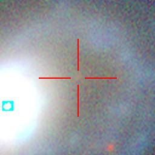
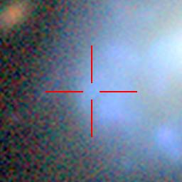

# Supernova_environments

This is a to explore the environments (and stare at image cutouts) of historic SNe

## Supernovae Type Ia in Globular Clusters (or Star Clusters in general)

Are there any compact onjects coincident with SN Ia explosion location?

### Relevant papers
- [Type Ia supernovae in globular clusters: observational upper limits by Voss & Nelemans 2012](https://ui.adsabs.harvard.edu/abs/2012A%26A...539A..77V/abstract)
- [A 2024 Masters Thesis: A Search for Type Ia Supernovae in Globular Clusters](https://clok.uclan.ac.uk/32336/1/Craggs%2C%20Alan_MSc_ThesisSubmission_20240622.pdf)
- [Formation and evolution of compact binaries in globular clusters - I. Binaries with white dwarfs by Ivanova et al 2006](https://ui.adsabs.harvard.edu/abs/2006MNRAS.372.1043I/abstract)
- [Observational Clues to the Progenitors of Type Ia Supernovae by Maoz et al](https://ui.adsabs.harvard.edu/abs/2014ARA%26A..52..107M/abstract)
- [A Type Ia Supernova near a Globular Cluster in the Early-type Galaxy NGC 5353](https://ui.adsabs.harvard.edu/abs/2024ApJ...968L...6B/abstract)
- [Star Clusters as Type Ia Supernova Factories by Shara & Hurley 2002](https://ui.adsabs.harvard.edu/abs/2002ApJ...571..830S/abstract)

## Prompt Supernovae Type Ia in young star-forming regions)

Are there any blue compact regions dominated by nebular emission coincident with SN Ia explosion location?

